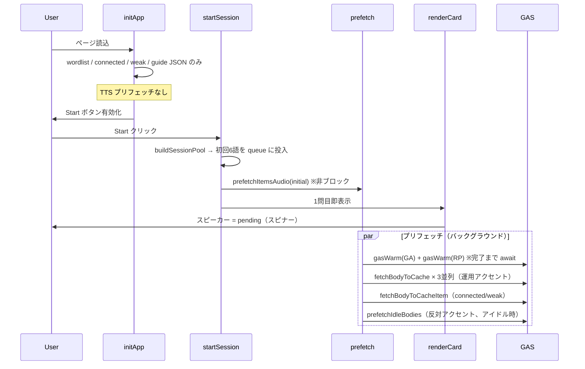

# 1問目音声遅延 — 現状整理・改善案・Claude 相談用資料

> 作成日: 2026-07-10  
> 種別: UX改善 / TTS レイテンシ  
> 対象: 全言語・全モード・GA/RP 共通  
> 前提: RP 音声の未格納は GAS バッチで今後解消予定（本ドキュメントでは RP 欠損そのものは論点外）

---

## 0. 問題の要約

**症状:** セッション開始後、1問目を表示した時点でスピーカーボタンにローディングスピナーが出続け、音声の取得完了まで相当な待ちが発生する。一度キャッシュされると以降は快適。

**許容ライン:** 1問目から再生可能になるまでの待ちは許容しがたい。

**スクリーンショット（再現例）:** Mode A / IPA read & write / One word (GA) / 1問目 `after` /ˈæftɚ/ — スピーカー位置にスピナー表示中。

---

## 1. 現状の実装

### 1-1. アーキテクチャ概要

```
ブラウザ (index.html)
  ├─ メモリキャッシュ (memAudioCache: Map)
  ├─ localStorage (ipa_tts_v2:{accent}:{slug})
  └─ fetch → GAS Web App (gas/Code.gs)
                ├─ Google Drive キャッシュ (IPA-TTS-Audio)
                └─ ミス時 OpenAI gpt-4o-mini-tts 生成 → Drive 保存
```

音声は **3段キャッシュ** で解決する:

| 層 | 保存先 | キー例 | 永続性 |
|----|--------|--------|--------|
| L1 | `memAudioCache` (Map) | `ga:after` | セッション内 |
| L2 | `localStorage` | `ipa_tts_v2:ga:after` | ブラウザ跨ぎ |
| L3 | Google Drive | `after__ga_v2.mp3` | グローバル |

**未使用:** IndexedDB, Service Worker, Cache API, `<audio preload>`, HTTP Range 等。

### 1-2. 主要定数・URL

```javascript
// index.html L1941-1943
const GAS_TTS_URL = "https://script.google.com/macros/s/AKfycbzjvLjcuv19zWm-boiGgREsQCdp4O0dXZh_eYQTFsyyBfAv8Jb2MjAMQpyOT61thgU0/exec";
const PREFETCH = { warmChunk: 6, warmParallel: 2, bodyParallel: 3 };
const SESSION_INITIAL = 6;  // 初回キュー投入数
```

### 1-3. セッション開始フロー



**起動箇所:**

- `initSessionQueue()` → `appendSessionBatch(6)` → `prefetchItemsAudio(initial)`  
  (`index.html` L2475-2482)
- `startSession()` → `renderCard()` はプリフェッチ完了を **待たない**  
  (`index.html` L2484-2498)

### 1-4. プリフェッチの詳細 (`prefetchItemsAudio`)

```javascript
// index.html L2289-2345（要約）
function prefetchItemsAudio(items) {
  // 1. audioReady Map を pending/ready に設定 → refreshAllSpeakers()
  (async () => {
    // 2. ★ GA と RP の warm を両方完了するまで await
    await Promise.all([gasWarm(words, cur, token), gasWarm(words, other, token)]);

    // 3. 運用アクセントの本体取得（3並列ワーカー、語順は Set 由来で先頭保証なし）
    await Promise.all([...bodyWorker × 3]);

    // 4. connected/weak は順次 fetchBodyToCacheItem
    // 5. 反対アクセントは requestIdleCallback で遅延取得
  })();
}
```

**warm エンドポイント** (`gas/Code.gs` L252-258):

- `GET ?warm=1&words=w1,w2,...&accent=ga|rp`
- 最大 6 語/リクエスト (`WARM_MAX = 6`)
- Drive 確認 → なければ OpenAI 生成 → **base64 は返さない**（JSON サマリのみ）
- GAS 内は **直列** で各語を処理

**本体取得** (`fetchBodyToCache`):

- `GET ?word=after&accent=ga`
- Drive ヒット or OpenAI 生成 → **base64 全体を JSON で返却**
- クライアントで Blob URL 化 → localStorage + mem に保存

### 1-5. 再生 (`speak`)

```javascript
// index.html L2369-2404
async function speak(text, opts) {
  // mem → localStorage → fetchAudioFromGas の順
  // 未取得なら GAS へその場 fetch（フォールバック）
  await audio.play();
}
```

キャッシュミス時は `setSpeakerBusy(true)` で全スピーカーにスピナー。

### 1-6. スピーカー UI 制御

| 状態 | 見た目 | 操作 |
|------|--------|------|
| `pending` | disabled + `.loading` スピナー | 不可 |
| `ready` / LS・mem ヒット | 活性 | 即再生 |
| `failed` | 活性（押下で speak フォールバック） | 可 |

`refreshSpeakerFor()` / `refreshSpeakerForItem()` が表示中カードの語だけ評価。

### 1-7. モード別の 1 問目挙動

| モード | 1問目の自動再生 | 音声ロード開始 |
|--------|----------------|----------------|
| **Mode A decode/encode** | なし | Start 時プリフェッチ |
| **Mode B study** | あり（250ms 後 `speak()`） | プリフェッチと競合しうる |
| **Mode B MCQ/dict** | あり（200-250ms 後） | 同上 |
| **Connected / Weak** | なし（reveal 時 200ms 後） | warm 対象外、直接 body fetch |
| **回答 reveal** | あり（200ms 後） | キャッシュ済みなら即時 |

Mode A（スクリーンショットのケース）では **カードは即表示** されるが、スピーカーはプリフェッチ完了までスピナー。

### 1-8. ページ読込時 (`initApp`)

```javascript
// index.html L1365-1380
async function initApp() {
  await loadLocale(LANG);
  Promise.all([
    loadWordlist(), loadConnected(), loadWeak(), loadGuide()
  ]).then(() => { /* Start ボタン有効化 */ });
}
```

**セットアップ画面にいる間は TTS を一切先読みしない。** ユーザーがフィルタ・CEFR・モードを選んでいる数十秒が未活用。

### 1-9. サーバー側の事前ストック

| 仕組み | ファイル | 内容 |
|--------|----------|------|
| セッション warm | `gas/Code.gs` `handleWarm_` | クライアント Start 時、最大 6 語×chunk |
| GA 一括バッチ | `gas/BatchWarm.gs` | 時間トリガーで ~500 語/run、OpenAI 20 並列 |
| 語彙リスト | `gas/BatchWords.gs` | `scripts/export_batch_words.py` 生成 |

Drive に既にファイルがあれば warm は `cached`（数秒）、なければ OpenAI 生成（数秒/語）。

### 1-10. 過去の改善（2026-06 実装済み）

2026-06 に **B+A 方式** のプリフェッチを実装済み（`docs/cursor/briefs/cursor-tts-prefetch-warmup.md` 参照）:

- warm で Drive ストック先行
- 運用アクセントのみ本体先読み
- 反対アクセントはアイドル時
- `prefetchToken` で Start 連打時中断

**それでも 1 問目の初回体験が遅い** のが今回の論点。

---

## 2. 遅延の主因（分析）

優先度順:

### 原因 A: warm 完了が body 取得のゲートになっている

```javascript
await Promise.all([gasWarm(words, cur, token), gasWarm(words, other, token)]);
// ↑ この await が終わるまで 1 問目の本体取得が始まらない
```

初回セッションで Drive 未キャッシュの語が含まれると:

- GA warm: 6 語 × OpenAI 直列 ≒ 十数秒〜
- RP warm: 同上（**ユーザーが RP を使わなくても待つ**）
- その後ようやく body fetch 開始

**影響度: 最大** — 1 問目の待ちの大部分を説明しうる。

### 原因 B: 1 問目の語が優先されていない

`words` は `Set` 由来の **重複排除リスト**。3 並列ワーカーが `wi++` で順に処理するが、**表示中の `S.queue[0].w` を最優先するロジックはない**。

6 語プリフェッチ中、1 問目が 4 番目以降なら、他語の body 取得が先に走る。

### 原因 C: GAS 往復 + base64 JSON のオーバーヘッド

Drive キャッシュヒットでも:

1. ブラウザ → GAS（リダイレクト含む）
2. GAS → Drive 読込
3. base64 エンコード → JSON レスポンス（~12KB/語）
4. クライアントで atob → Blob → Object URL

毎リクエストこれを繰り返す。並列 3 でも **1 語あたり数百 ms〜数秒** は普通にかかる。

### 原因 D: セットアップ画面での先読みなし

ユーザーが設定を触っている間に **0 リクエスト**。Start クリックが初の TTS 通信になる。

### 原因 E: localStorage ミス時のコールドスタート

新端末・シークレット・キャッシュクリア後は L1/L2 とも空。毎回 GAS フル往復。

### 原因 F: Mode B の自動再生との競合

`setTimeout(() => speak(c.w), 250)` がプリフェッチと同時に走り、未取得なら `speak()` 側でも GAS fetch → **二重リクエスト** の可能性（`speakBusy` で一部は直列化されるが、待ちは残る）。

### 原因 G: Connected / Weak は warm 対象外

該当タブでは `gasWarm` をスキップせず special item として直接 body fetch。初回はより遅い。

---

## 3. Cursor としての改善提案

RP 欠損の事前格納はユーザー側で対応予定のため、以下は **クライアント・GAS プロトコル・UX** 中心。

### 提案 1（即効・低リスク）: 1 問目を最優先で body 取得

`prefetchItemsAudio` の先頭で:

```javascript
const first = items[0];
if (first && !isConnectedItem(first) && !isWeakItem(first)) {
  await fetchBodyToCache(first.w, cur, token);  // warm を待たない
}
```

**効果:** Drive にファイルがあれば warm なしで即ヒット。1 問目だけ最速化。

### 提案 2（即効・低リスク）: warm と body の直列ゲートを外す

現状:
```
warm(GA) + warm(RP) 完了 → body(GA) × N
```

推奨:
```
並行 {
  fetchBodyToCache(1問目, cur)     // 最優先
  gasWarm(words, cur)              // 現在アクセントのみ
  gasWarm(words, other)            // 低優先 or スキップ
  fetchBodyToCache(残り, cur)      // 並列 3
}
```

**効果:** 初回でも Drive ヒット時は warm 待ちゼロ。OpenAI 生成が必要な語だけ warm が効く。

### 提案 3（中リスク）: Start 時の RP warm をやめる / 遅延する

ユーザーは GA/RP 運用アクセントを設定画面で選んでいる。**反対アクセントの warm はアイドル時 or 切替時だけ** で十分（RP 本体は GAS バッチで後から埋まる前提）。

**効果:** Start 時の warm 時間をほぼ半減。

### 提案 4（中工数）: セットアップ画面での先読み

`initApp()` 完了後、または `updatePool()` / フィルタ変更時に:

- 次セッションで出やすい語（プール先頭 N 語、履歴ベース due 語）の **運用アクセント body のみ** 先読み
- Start クリック時には既に 1 問目が ready の可能性

**注意:** フィルタ変更で語集合が変わるため、キャンセルトークン必須。

### 提案 5（中工数）: GAS レスポンスの軽量化

| 案 | 内容 | 効果 |
|----|------|------|
| 5a | base64 JSON → **バイナリ直接返却** (`ContentService.createBinaryOutput`) | 転送量・デコード削減 |
| 5b | **バッチ body API** `?words=a,b,c&accent=ga` で複数語を 1 往復 | RTT 削減 |
| 5c | Drive ファイルの **公開 URL / 署名付き URL** を返し、クライアントが直接 GET | GAS プロキシ迂回 |

5c は最も効果が大きいが、Drive 公開設定・CORS の設計が必要。

### 提案 6（UX）: 1 問目 ready までカード表示を遅延 or スケルトン

「待ちをなくす」別解として、**音声 ready になるまで Start→遷移を 200-500ms 遅らせる**（裏では既にプリフェッチ開始済み）。

ユーザーには「準備中」と見せつつ、実際にはセットアップ画面で先読みしていれば体感ゼロに近づく。

### 提案 7（ストレージ）: IndexedDB 移行

localStorage の base64 保存は同期 I/O + 容量制限 (~5MB)。IndexedDB ならバイナリ直保存・容量拡大。**初回以降の体感は向上**するが、1 問目コールドスタート自体は解決しない。

### 提案 8（インフラ）: GA バッチの拡張

既存 `BatchWarm.gs` は GA のみ。RP も同様のバッチを流せば、クライアント側の warm 依存が下がる（ユーザー計画と一致）。

---

### 推奨実装順序（Cursor 案）

| 順位 | 施策 | 工数 | 1問目への効果 |
|------|------|------|---------------|
| 1 | 1 問目優先 body + warm ゲート解除 | 小 | 大 |
| 2 | Start 時 RP warm スキップ/遅延 | 小 | 中 |
| 3 | セットアップ画面先読み | 中 | 大（体感） |
| 4 | GAS バイナリ or バッチ API | 中〜大 | 中 |
| 5 | Drive 直リンク | 大 | 大 |

---

## 4. Claude に相談する際に添付すべきファイル

### 必須（コア実装）

| ファイル | 理由 |
|----------|------|
| `index.html` | クライアント全ロジック（TTS・プリフェッチ・UI・セッション）。**L1940-2405, L2465-2499, L2579-2596 付近が中心** |
| `gas/Code.gs` | GAS TTS プロキシ、warm、Drive キャッシュ、OpenAI 呼び出し |
| `gas/README.md` | API 仕様・キャッシュ命名規則 |

### 強く推奨（設計文脈）

| ファイル | 理由 |
|----------|------|
| `docs/cursor/briefs/cursor-tts-prefetch-warmup.md` | 2026-06 のプリフェッチ設計（B+A 方式）の意図・DoD |
| `docs/cursor/reports/cursor-implementation-report-tts-prefetch.md` | 実装済み内容の照合レポート |
| **本ファイル** `docs/cursor/briefs/cursor-tts-first-question-latency-consultation.md` | 問題定義・分析・Cursor 案 |

### 条件付き（議論が及ぶ場合）

| ファイル | いつ添付するか |
|----------|----------------|
| `gas/BatchWarm.gs` | サーバー側事前生成・バッチ戦略を議論する時 |
| `gas/BatchWords.gs` | 語彙カバレッジ・未キャッシュ語の割合を見積もる時 |
| `scripts/export_batch_words.py` | バッチ語彙の生成元を確認する時 |
| `tests/tts-ab-listener.html` | 連結句 TTS 実験・voice/speed パラメータを触る時 |
| `docs/cursor/briefs/cursor-connected-speech-tts-consultation.md` | Connected/Weak タブの遅延も論点に入る時 |
| `docs/reference/rp-tts-design-and-priority.md` | RP 全体設計の文脈が必要な時 |

### 添付不要（今回の論点外）

- `data/**/*.json` — 語彙データ本体（TTS フローには不要。語数統計だけなら `gas/BatchWords.gs` で足りる）
- RP 欠損の個別 hotfix パッチ
- 多言語 guide / gloss 関連

---

## 5. Claude への相談プロンプト例

以下をそのまま貼れる:

---

**背景:**  
英語発音トレーナー（SPA, `index.html` + GAS TTS）。全モード・GA/RP 共通で、セッション 1 問目の音声取得に数秒〜十数秒かかる。2 問目以降は localStorage/Drive キャッシュで快適。2026-06 に warm + prefetch は実装済みだが不十分。

**制約:**  
- RP 音声の Drive 未格納は別途 GAS バッチで解消予定（今回の主題ではない）  
- 1 問目から再生可能になるまでの待ちは UX 上許容できない  
- インフラは現状 GAS + Drive + OpenAI（大規模 CDN 移行は最後の手段）

**添付:**  
`index.html`, `gas/Code.gs`, `cursor-tts-prefetch-warmup.md`, `cursor-tts-first-question-latency-consultation.md`

**相談したいこと:**  
1. 現状ボトルネック（warm ゲート、1 問目非優先、GAS base64 往復）の評価は妥当か  
2. **1 問目を sub-second で再生可能にする** ための最善アーキテクチャ（クライアント / GAS / プロトコル / UX）  
3. 提案 1-5 のトレードオフと、推奨する実装順序  
4. warm を残すべきか、Drive バッチが進めばクライアント warm は不要か  

---

## 6. 参考: 主要関数インデックス（index.html）

| 行付近 | 関数 | 役割 |
|--------|------|------|
| L1365 | `initApp` | データ読込のみ、TTS なし |
| L1941 | `GAS_TTS_URL`, `PREFETCH` | 定数 |
| L2064 | `fetchAudioFromGasAccent` | 単語 TTS fetch |
| L2158 | `gasWarm` | Drive warm（chunk×並列） |
| L2198 | `fetchBodyToCacheItem` | connected/weak body |
| L2223 | `fetchBodyToCache` | 単語 body → LS/mem |
| L2289 | `prefetchItemsAudio` | **プリフェッチ本体** |
| L2369 | `speak` | 再生 |
| L2475 | `initSessionQueue` | 初回 batch + prefetch 起動 |
| L2484 | `startSession` | セッション開始 |
| L2580 | `renderCard` | カード表示 + refreshAllSpeakers |

## 7. 参考: GAS 主要関数（Code.gs）

| 行付近 | 関数 | 役割 |
|--------|------|------|
| L230 | `warmOne_` | 1 語 warm |
| L252 | `handleWarm_` | warm エンドポイント |
| L261 | `doGet` | メイン TTS エンドポイント |
| L334-376 | Drive → OpenAI → 返却 | 本体取得パイプライン |

---

## 8. 計測のすすめ（実装前のベースライン）

Claude / 実装前に DevTools Network で以下を記録すると議論が具体化する:

1. Start クリック → 1 問目スピーカー活性化までの **wall time**
2. 最初の `warm=1` リクエストの所要時間と `results[].status`（cached vs generated）
3. 最初の `?word=` body リクエストの所要時間と `source` フィールド
4. warm 完了前に body リクエストが走っているか（現状は走らないはず）
5. localStorage に `ipa_tts_v2:ga:after` がある状態 vs ない状態の比較

**期待:** コールドスタートで warm が `generated` を含む場合、1 問目待ち ≒ warm 時間 + body 時間。キャッシュ済みなら warm `cached` + body `cache` で sub-second 可能なはず — それでも遅いなら GAS 往復自体がボトルネック。
